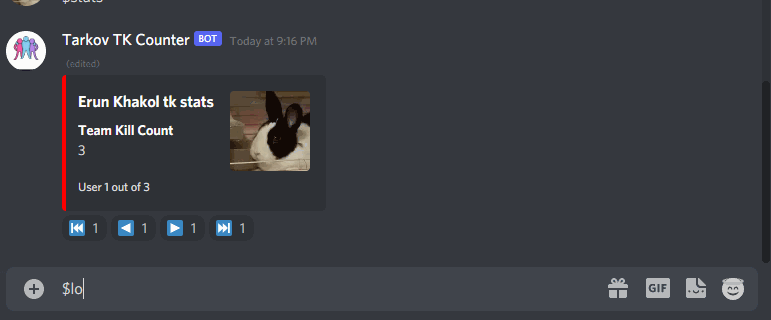
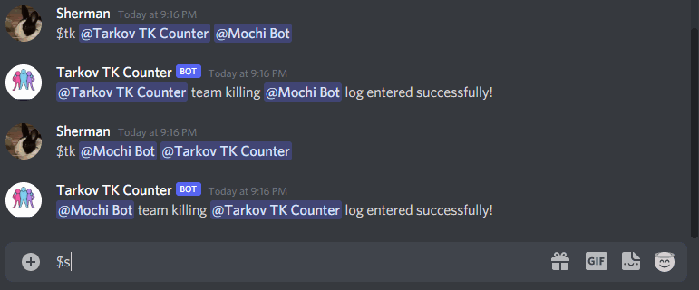
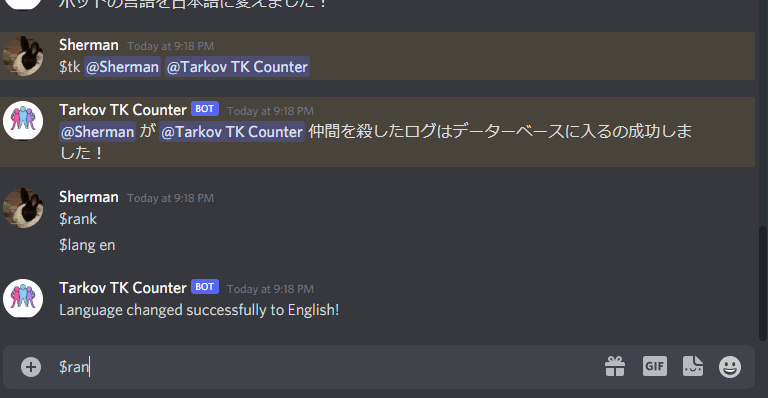
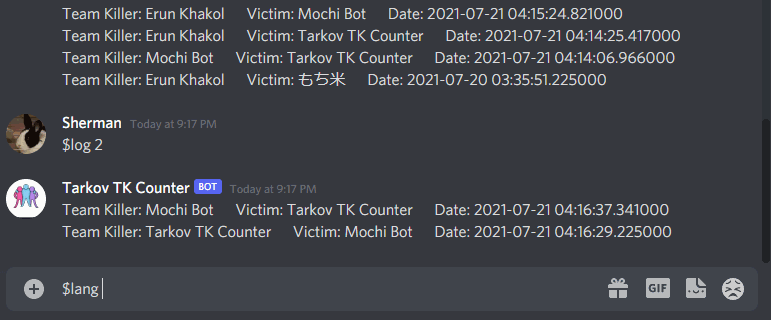

# TK Counter Bot
## Information
TK Counter Bot is a simple bot that you can use to store team kill counts of users within your discord server and retrieve the data in the form of most recent team kills, rankings, etc. Currently, this bot supports English and Japanese.
## Features
- Insert team kill log entries into the bot database
- Retrieve team kill counts/stats for a user or all users
- Retrieve ranking ordered by top number of team kills for all users
- See the most recent team kill entries entered into the database
- Supports Japanese and Engish for messages

## Tech
- `Python3`
- `discord.py`

## Commands
### $tk
The tk command enters a kill log into team kill database.
`$tk @killer @killed`  
  

### $log (#)
The log command shows the most recent (#) team kill logs of the server. The # parameter defaults to 10 in excluded.
`$log 3`  
  

### $stats (@user)
`$stats @sherman`
See the stats of a particular user.  
  
  
Excluding user parameter allows you to scan through the stats of all users using reactions on the message.  
  

### $rank
Shows the team kill leaderboard of the server.  
  

### $lang (language)
Changes the language of the messages of the bot. Currently supported parameters
- English: `en`
- Japanese: `jp`  

